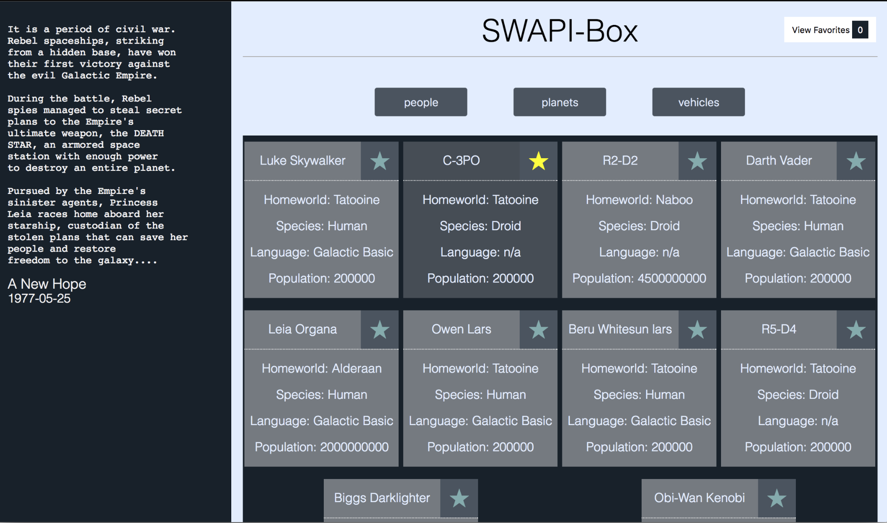
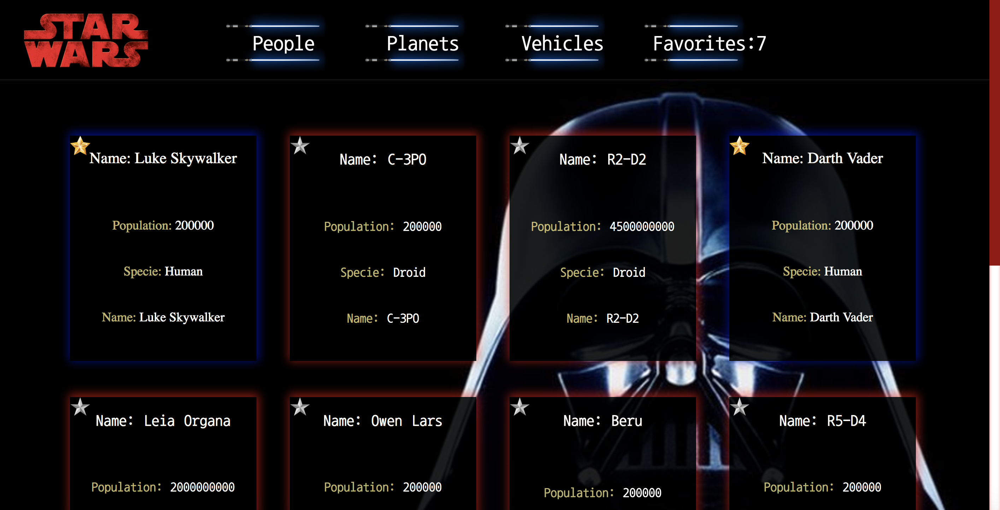
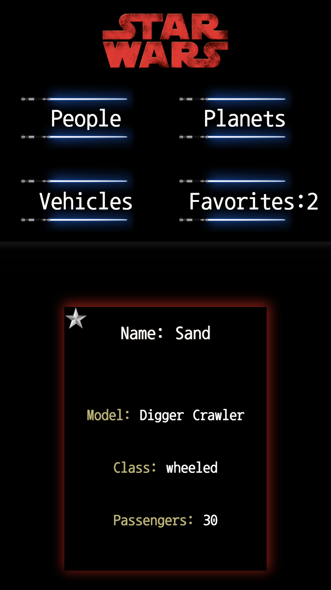

# SWAPIbox

The point of this project 

[create-react-app](https://github.com/facebookincubator/create-react-app) boilerplate.

### Author:

Stephanie Ospina [GitHub](https://github.com/sospinar21)  

### Original comp:

  

### My design:

  

## Set Up

* Clone this project

* Run `npm install` from the root directory

* Run `npm start` and visit localhost:3000 in your browser

* Run tests with `npm test`
# SWAPI-box
